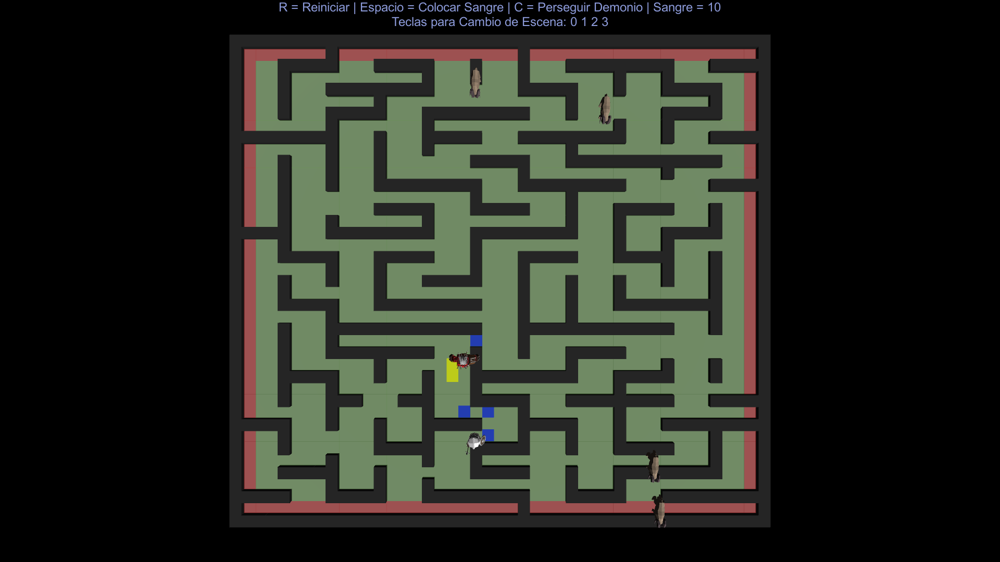
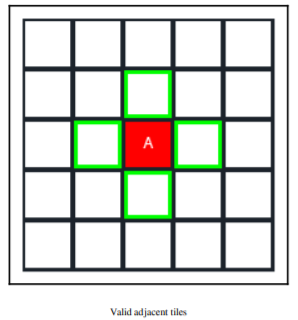
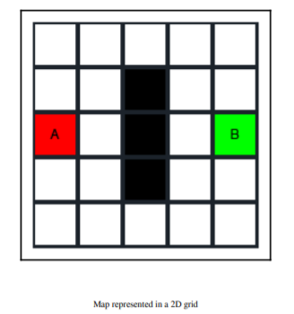
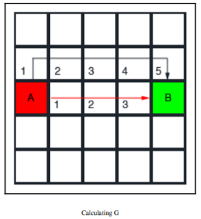
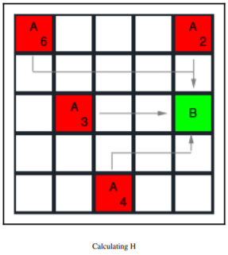
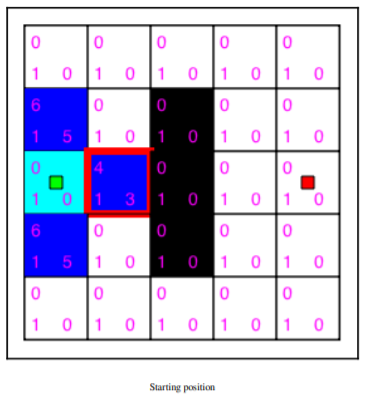
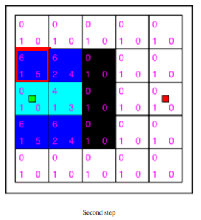
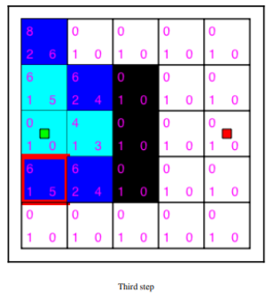
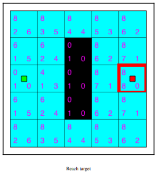
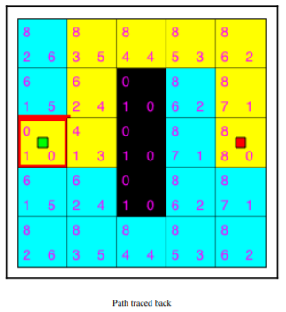

# IAV 2022 - Cristian Castillo de León - Proyecto Final
### Esta es la documentación para el proyecto final de la asignatura de Inteligencia Artificial para Videojuegos del curso 2021/2022.

[EJECUTABLE FINAL DE PROYECTO](https://github.com/Crisca06/IAV22-CASTILLO_DE_LEON/releases/tag/IAV22-CASTILLO_DE_LEON_RELEASE)

## Introducción al Proyecto
El proyecto final se centra principalmente en un pequeño juego del género de terror y mazmorras, con generación aleatoria de las mismas.
La historia se basa en un demonio aterrador que se encuentra en una mazmorra a punto de obtener un poder prohibido, el protagonista se adentra en dicha mazmorra y debe encontrar las 7 cabras del sacrificio para poder detener al demonio. Las cabras se encontrarán repartidas de forma aleatoria por la mazmorra y solo podrán merodear por la zona hasta encontrarse con el jugador, entonces le darán su sangre, para lograr todo este comportamiento se hará uso de una máquina de estados. La sangre servirá para manchar la mazmorra, impidiendo al demonio pasar por dichas zonas. Si dicho demonio llegara a ser encerrado en un circulo o cuadrado de sangre, entonces habrá perdido.

En un principio el demonio únicamente divagará por la mazmorra ignorando al jugador pero si éste comienza a sacrificar la sangre de las cabras, se dará cuenta de lo que está intentando el jugador y comenzará a alejarse de la zona, evitando así ser atrapado.

En cuanto a la generación aleatoria de las mazmorras, se tiene pensado crear un generador que permita recrear una mazmorra con cabras colocadas aleatoriamente.

## Vista General

<p float="left">
   
</p>

## Planteamiento

## Demonio
Será la IA principal del proyecto, pensado como una inteligencia artificial basada en el escape y el evitar ser atrapado por la sangre de las cabras. Para ello se hará uso del conocido algoritmo de A* que permitirá al demonio elegir el camino más óptimo a la hora de llegar a una zona. La manera en la que el demonio eligirá a dónde ir se basará en un mapa de influencia que cambiará de forma dinámica dependiendo de las zonas marcadas por sangre.

La sangre cambiará el mapa de influencia y dependiendo de la influencia marcada en el mapa el demonio seleccionará una zona libre de influencia a la que dirigirse, evitando en mayor medida las zonas marcadas por sangre y evitando así ser encerrado.

### A*
El algoritmo de A* se puede plantear sobre una matriz de celdas. Este algoritmo destaca por su rendimiento, precisión y facilidad de implementación. Se parte de la base de que los agentes que lo navegan conocen de antemano la disposición de los obstáculos y los costes de cada casilla del mapa, en el caso de este proyecto, los costes de las casillas cambiarán de forma dinámica con la sangre colocada sobre el mapa. 

Aunque tiene sus inconvenientes. Uno de ellos es que si el mapa es demasiado grande, tener en cuenta todo el mapa y explorar todas sus opciones puede resultar costoso. Pero no será un problema en este proyecto debido al tamaño del mapa.

<p float="left">
   
   
</p>

Este algoritmo estará basado en el libro "Unity Artificial Intelligence Programming". La explicación que viene en el libro es muy clara, así que se usará la misma explicación a continuación.

Se parte de una matriz por casillas. Se tiene una casilla Origen y una casilla Destino. El resto de casillas pueden ser obstáculos o casillas de distintos costes. Para determinar el coste de cada casilla se usarán tres variables:
 - G es el coste de ir desde la casilla Origen a la casilla actual.
 - H es el coste ***estimado*** de ir de la casilla actual a la casilla destino, es decir, suponiendo que no hay obstáculos que impidan ir por el camino menos costoso.
 - F es el coste de sumar G y H. Este coste es el que se tendrá en cuenta para elegir el camino más óptimo.
 
<p float="left">
   
   
</p>

El funcionamiento consiste en lo siguiente. Se comienza en la casilla Origen y se añaden a un vector de casillas no visitadas las adyacentes a la casilla Origen. De las casillas no visitadas se calculan los costes mencionados. Se comprueba cual de ellos es menor y esa casilla pasa a marcarse como visitada. En caso de ser todos los costes iguales se coge en último añadido al vector de no visitados por eficiencia.

Este proceso se vuelve a repetir partiendo de la casilla que se ha marcado como visitada. En caso de encontrar un obstáculo o una casilla que se encuentra fuera de los limites de la matriz, esta casilla no se tendrá en cuenta. Al finalizar todas las llamadas, habremos visitado todas las componentes conexas, es decir, aquellas casillas que sean accesibles desde la casilla Origen. Si la casilla destino es alcanzable, habremos obtenido el camino más óptimo. 

<p float="left">
   
  
    
</p>

Cada casilla guarda información sobre la casilla anterior desde la que fue alcanzada, con lo que podemos reconstruir el camino óptimo.

<p float="left">
   
   
</p>

#### Pseudocodigo

Para el algoritmo A* se hará uso de varias clases que especificaremos a continuación: 
- Node.cs: es la unidad básica de la mazmorra, conteniendo la información de una sola casilla.

```
 class Node:
  float costeTotal; //G
  float costeEstimado; //H
  Vector3 posicion;
  Node parent;
  bool bObstacle;
```
Los Nodos serán agrupados y ordenados en una cola de prioridad.

- PriorityQueue.cs: es una cola que ordena los elementos en de menor a mayor. Esta cola estará adaptada a la clase Node.cs y se ordenará en función del coste estimado. 

- GridManager.cs: se encarga de la gestión y de contener las casillas del tablero (mazmorra) en forma de nodos. 

```
 class GridManager:
 int numOfRows;
 int numOfColumns;
 float gridCellSize;
 Vector3 origin = new Vector3();
 GameObject[] obstacleList;
 Node[,] nodes {get; set; }

 void CalculateObstacles() {
   int index = 0;
   for(int i ... i < numOfColumns ... i++)
       for(int j ... j < numOfRows ... j++) {
           Vector3 cellPos = GetGridCellCenter(index);
           Node node = new Node(cellPos);
           nodes[i, j] = node;
           index++;
       }
       
   //Marcaremos como obstáculos los nodos almacenandos
   //en una lista dichos nodos
}

 //Método con el que recuperar los vecinos de un nodo en partículas con
 //ayuda de los métodos GetRow() y GetColumn()
 void GetNeighbours(Node node, ArrayList neighbors){
   Vector3 neighborPos = node.position;
   int neighborIndex = GetGridIndex(neighborPos);
   
   vector<Vector2> adyacentes = {(-1.0), (+1,0), (0,1), (0,-1)}
   for(Vector2 posicion in adyacentes){
       Vector2 pos = origen.pos + elem; 
       //comprobar que esta dentro de los limites del tablero
       // y no es un obstáculo 
       Assigneoghbour(pos); 
   }

 void AssignNeighbour(pos){

   if(posValida(pos)){
      Node node = nodes[pos.x, pos.y];
      if(!node.bObstacle) addNeighbours(node);
   }
 }
}
```

- AStar: clase que implementa el algoritmo de búsqueda de caminos. Se usará una cola de prioridad (PriorityQueue.cs) y la Heuristica Manhattan.

```
 class Astar{
   //cola de prioridad, ordena los nodos no visitados por coste de menor a mayor
   public static PriorityQueue openList;
   //mapa de nodos ya visitados, busqueda eficiente de nodos
   public static HashSet<Node> closedList;
   
   public static ArrayList FindPath(Node start, Node goal) {
       //Inicializacion de variables
       openList = new PriorityQueue();
      openList.Push(start);
       start.nodeTotalCost = 0.0f;
       start.estimatedCost = HeuristicEstimateCost(start, goal);
       closedList = new HashSet<Node>();
       Node node = null;
       //se consultan los nodos no visitados en orden por menor coste
       while (openList.Length != 0) {
           node = openList.First();
           //hemos llegado a la meta?
           if (node.position == goal.position) {
               return CalculatePath(node); //generar camino
           }
           //Create an ArrayList to store the neighboring nodes
           ArrayList neighbours = new ArrayList();
           //calculamos los vecinos
           GridManager.instance.GetNeighbours(node, neighbours);
           //para cada vecino...
           for (int i = 0; i < neighbours.Count; i++) {
               Node neighbourNode = (Node)neighbours[i];
               //si no esta ya visitado
               if (!closedList.Contains(neighbourNode)) {
                   //calculamos los costes
                   float cost = HeuristicEstimateCost(node,
                   neighbourNode);
                   float totalCost = node.nodeTotalCost + cost;
                   float neighbourNodeEstCost = HeuristicEstimateCost(
                   neighbourNode, goal);
                   neighbourNode.nodeTotalCost = totalCost;
                   neighbourNode.parent = node;
                   neighbourNode.estimatedCost = totalCost +
                   neighbourNodeEstCost;
                   //si no esta pendiente de visitar
                   if (!openList.Contains(neighbourNode)) {
                       openList.Push(neighbourNode);
                   }
               }
           }
       //se añade el nodo como visitado
       closedList.Add(node);
       //se elimina de los pendientes por visitar
       openList.Remove(node);
       }

       //si la meta es alcanzable se devuelve
       if (node.position != goal.position) {
           Debug.LogError("Goal Not Found");
           return null;
       }
       //se reconstruye el camino ya calculado gracias a los padres de cada nodo
       return CalculatePath(node);
   }
}
```

### Mapa de Influencia

El mapa de influencia es la primera técnica del análisis táctico y permite identificar zonas de influencia de cada unidad en el escenario de un videojuego. El mapa de influencia que se utilizará en este proyecto estará dividido principalmente en dos scripts:

- Mapa de influencia a nivel logico y visual. Este dividira el escenario en casillas según el tamaño del escenario. Dicha division de casillas es configurable y estara establecida por el tamaño de casilla determinado. Este script contendra varios metodos para reajustar la prioridad de cada casilla del mapa de influencia.

- Script de las casillas del mapa que contendrán la informacion de la prioridad de unidad en la casilla. Este script también se encargará de colorear las casillas de color dependiendo de su contenido de prioridad. Para su uso habrá que crear un objeto casilla que tendrá este script entre sus componentes.

El mapa de influencia será de esta forma visible y no visible en el escenario.

```
class InfluenceMap {
    int cellSize;
    int fils, cols;
    
    Casilla[,] matriz;
    Vector3 posInicial;
    
    void initMap() {
          cols = Map.size.z / cellSize;
          fils = Map.size.x / cellSize;
          
          matriz = new Casilla[fils, cols];
          float centerCell = cellSize / 2;
         
          for(int i = 0; i < fils; i++){
              for(int j = 0; j < cols; j++)
                  //Se crea el prefab de cada casilla y se
                  //añade a la matriz de casillas
          }
    }
    
    void updateInfluenceMap(Casilla casilla, int influence, Blood blood){
          //Añadimos influencia a la casilla en el radio indicado por la unidad, la sangre
    }
    
   public Casilla GetCasilla(Position pos)
      {
          //Se obtiene la casilla colocada en la posición en la que se encuentra pos.
          int i = Mathf.Abs((int)((pos.position.x - posInicial.x) / cellSize));
          int j = Mathf.Abs((int)((pos.position.z - posInicial.z) / cellSize));

          return matriz[i, j];
      }
}
```

### Seguimos con el demonio

Por lo tanto, el demonio tendrá una máquina de estados que le permitirá cambiar entre los distintos estados, éstos estarán basados principalmente en el nivel de influencia en el que se encuentra o que le rodea. El demonio podrá detectar la sangre alrededor suya y de esta forma decidirá qué hacer a continuación.

Los distintos estados del demonio serán:

- Merodeo: El demonio se moverá entre casillas que se encuentren con un bajo nivel de influencia de la sangre y deambulará por el escenario hasta detectar sangre a su alrededor. Si hay sangre pero el jugador no se encuentra cerca seguirá merodeando ya que no hay riesgo de que lo atrapen.

- Huida: El demonio buscará una zona alejada que se encuentre libre de influencia de sangre, huyendo y esquivando así el ser atrapado.

- Atrapado: El demonio al ser atrapado activará su sistema de partículas y enviará la información de que ha ganado el jugador.

## Cabras

Serán personajes con una máquina de estados simple basada en el merodeo y el hecho de haber interactuado con el jugador.
Dejarán su sangre para que el jugador pueda pintar por el mapa.

## Funcionalidades

### A. Correcto funcionamiento del merodeo del Demonio
### B. Correcto funcionamiento del merodeo de las cabras en una zona limitada
### C. Huida del demonio hacia zonas con poca sangre
### D. Interacción del jugador con las cabras para obtener sangre y colocar sangre en el mapa
### E. Correcto funcionamiento del mapa de influencia
### F. Victoria y Derrota (El demonio ha sido atrapado o el jugador se ha quedado sin sangre)

Todo el movimiento de las IAs se realizará con A*. 
Se utilizará la versión de Unity de Bolt (llamada Visual Scripting) para la creación de las máquinas de estados. La importación de Bolt produce muchos problemas y la versión creada por Unity es prácticamente la misma.

## Bibliografía

- La idea fue pensada por primera vez en el juego de recreativa clásica Qix, en la que se coloreaba la pantalla intentando encerrar unas figuras y al conseguirlos, estas se coloreaban. [ENLACE](https://www.youtube.com/watch?v=EdEOH5O2kCo)

- Unity Artificial Intelligence Programming - Fourth EDITION
- Material de las transparecias de clase (Federico Peinado)
